# TC Restaurant Management

## Overview

**TC Restaurant Management** is a REST API built with Java and Spring Boot for managing users in a restaurant system. It supports two user profiles — **customers** and **restaurant owners** — with full CRUD operations for each.

Authentication is handled via **JWT**: after logging in, the user receives a token valid for 24 hours, which must be sent in the `Authorization: Bearer <token>` header on all protected requests. Users can only modify or delete their own data; attempting to change another user's data returns `403 Forbidden`.

All error responses follow the **RFC 7807 Problem Detail** format. The API is documented via **Swagger UI** and ships with a complete **Postman collection** — including automatic token capture after login — covering success and error scenarios for every endpoint.

---

## Tech Stack

| Layer | Technology |
|---|---|
| Language | Java 21 |
| Framework | Spring Boot 4.x |
| Persistence | Spring Data JPA + Hibernate + MySQL 8 |
| Security | Spring Security + JWT (JJWT 0.12.6) |
| Documentation | SpringDoc OpenAPI 2.8.6 (Swagger UI) |
| Containerization | Docker + Docker Compose |

---

## Architecture

The project follows the **MVC (Model-View-Controller)** pattern, adapted for REST APIs:

```
Request → Controller → Service → Repository → Database
                ↕              ↕
              DTOs          Domain
```

- **Controller** — receives HTTP requests, validates input, delegates to the service, returns responses. No business logic here.
- **Service** — contains all business rules (uniqueness checks, authorization, password encoding).
- **Repository** — Spring Data JPA interfaces for database access.
- **Domain** — JPA entities (`BaseUser`, `Customer`, `RestaurantOwner`, `Address`).
- **DTO** — decouples the API contract from the internal domain model.

### Package structure

```
com.fiap.tc.restaurant
├── config/          # Security, Swagger, Jackson beans
├── controller/v1/   # REST controllers (Auth, Customers, RestaurantOwners)
├── domain/          # JPA entities
├── dto/             # Request and response records
├── exception/       # Custom exceptions + GlobalExceptionHandler
├── filter/          # JwtAuthFilter (OncePerRequestFilter)
├── mapper/          # Entity ↔ DTO converters
├── repository/      # Spring Data JPA interfaces
├── security/        # Custom 401/403 handlers
└── service/         # Interfaces + implementations
```

### Authentication flow

```
POST /api/v1/auth/login
       │
       ▼
AuthenticationManager → UserDetailsServiceImpl (Customer or RestaurantOwner)
       │
       ▼
JwtService — generates HMAC-SHA token (24h expiration)
       │
       ▼
{ token, userId, userType }
```

Protected endpoints require `Authorization: Bearer <token>` header. The `JwtAuthFilter` validates the token on every request and sets the security context.

---

## Entities

All users share a common base via JPA **JOINED inheritance**:

```
base_users (id, name, email, login, password, role, lastModifiedAt, address fields)
    ├── customers          (id FK → base_users)
    └── restaurant_owners  (id FK → base_users)
```

`Address` is an embedded value object stored directly in `base_users` (no separate table).

### ER Diagram

`base_users` is the parent table holding all shared fields (identity, credentials, role, address). Both `customers` and `restaurant_owners` are child tables whose `id` is a foreign key referencing `base_users.id` — they have no direct relationship with each other.

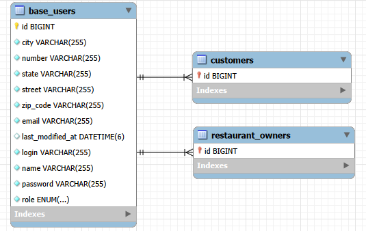

### Database — base_users table

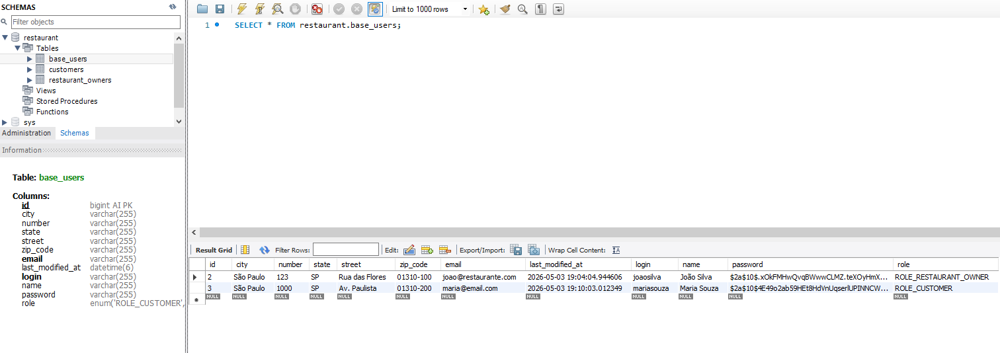

---

## Endpoints

### Public

| Method | Path | Description |
|---|---|---|
| `POST` | `/api/v1/auth/login` | Authenticate and get JWT |
| `POST` | `/api/v1/customers` | Register a customer |
| `POST` | `/api/v1/restaurant-owners` | Register a restaurant owner |

### Protected (require `Authorization: Bearer <token>`)

| Method | Path | Description |
|---|---|---|
| `GET` | `/api/v1/customers/{id}` | Get customer by ID |
| `GET` | `/api/v1/customers?name=` | Search customers by name |
| `PUT` | `/api/v1/customers/{id}` | Update customer (own data only) |
| `PATCH` | `/api/v1/customers/{id}/password` | Change password (own only) |
| `DELETE` | `/api/v1/customers/{id}` | Delete customer |
| `GET` | `/api/v1/restaurant-owners/{id}` | Get owner by ID |
| `GET` | `/api/v1/restaurant-owners?name=` | Search owners by name |
| `PUT` | `/api/v1/restaurant-owners/{id}` | Update owner (own data only) |
| `PATCH` | `/api/v1/restaurant-owners/{id}/password` | Change password (own only) |
| `DELETE` | `/api/v1/restaurant-owners/{id}` | Delete owner |

All errors follow **RFC 7807 Problem Detail** format.

---

## Running with Docker

**Prerequisites:** Docker Desktop, Maven 3.9+

```bash
# 1. Build the JAR
./mvnw clean package -DskipTests

# 2. Start containers
docker compose up --build
```

The API will be available at `http://localhost:8080`.

To stop:
```bash
docker compose down
```

### Environment variables

| Variable | Description | Default in compose |
|---|---|---|
| `SPRING_DATASOURCE_URL` | MySQL JDBC URL | `jdbc:mysql://mysql:3306/restaurant` |
| `SPRING_DATASOURCE_USERNAME` | DB username | `root` |
| `SPRING_DATASOURCE_PASSWORD` | DB password | `root` |
| `JWT_SECRET` | Base64-encoded HMAC key (min 256 bits) | set in compose |

> For production, replace `JWT_SECRET` with a secure key: `openssl rand -base64 32`

---

## Testing the API

### Option 1 — Swagger UI

Access `http://localhost:8080/swagger-ui.html` after starting the application.

To test protected endpoints:
1. Call `POST /api/v1/auth/login` and copy the `token` from the response.
2. Click **Authorize** and enter `Bearer <token>`.
3. All protected requests will include the header automatically.

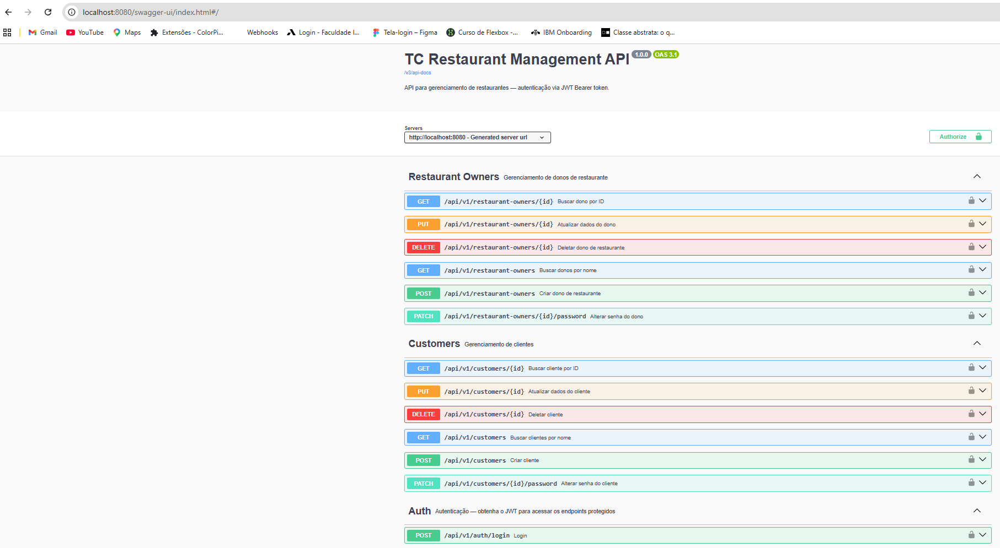

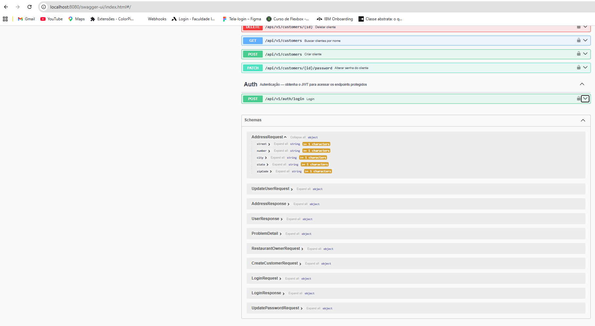

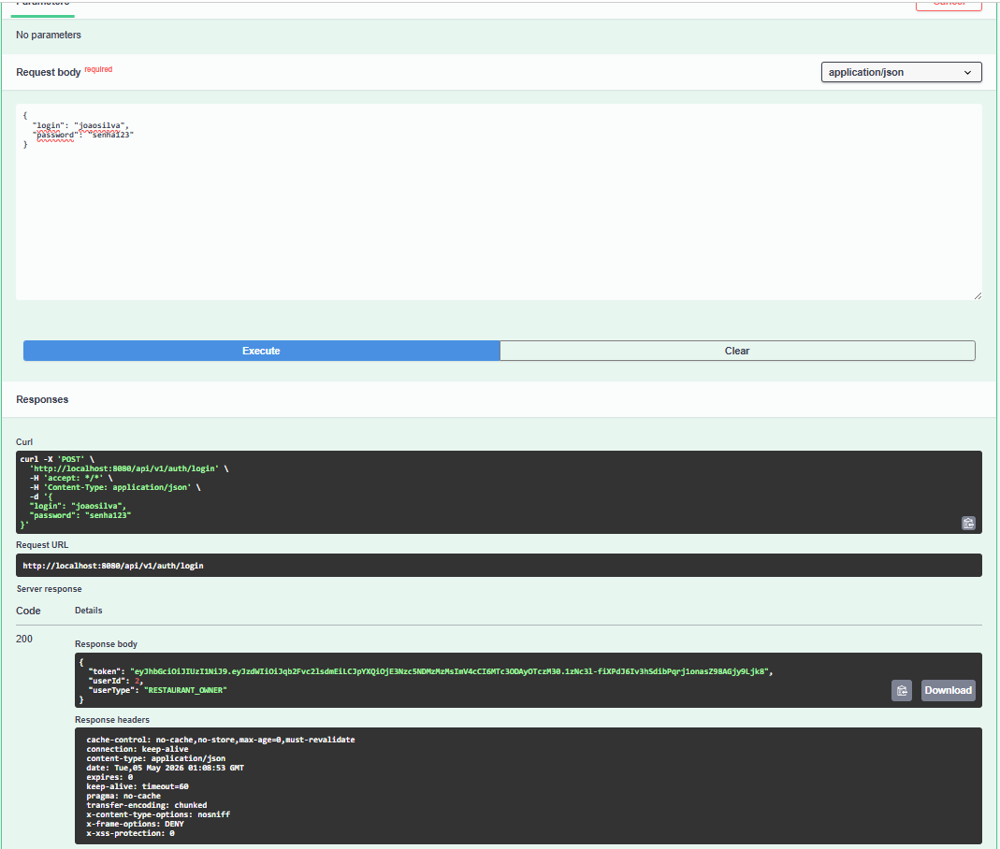

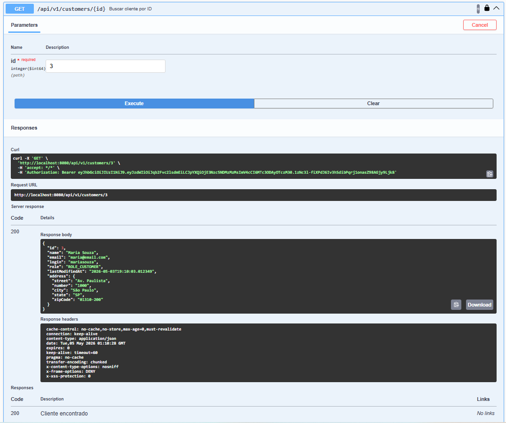

### Option 2 — Postman

Import both files from the `postman/` folder:
- `TC Restaurant Management.postman_collection.json`
- `TC Restaurant Management.postman_environment.json`

Select the **TC Restaurant - Local** environment. After running the **Login** request, the token is saved automatically to the `{{token}}` variable — no manual configuration needed.

The collection covers all endpoints including error scenarios (400, 401, 403, 404, 409).

#### Auth

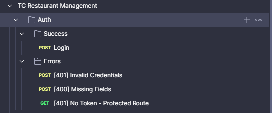

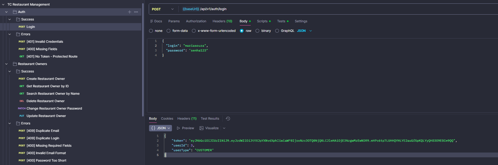

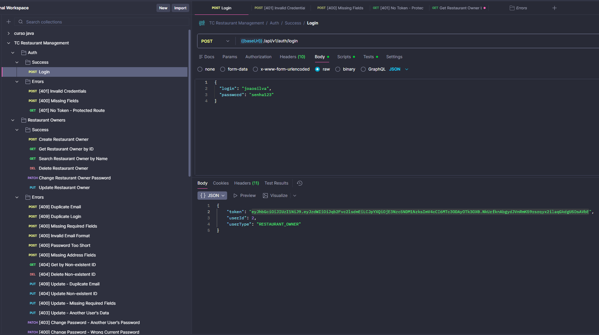

#### Customers

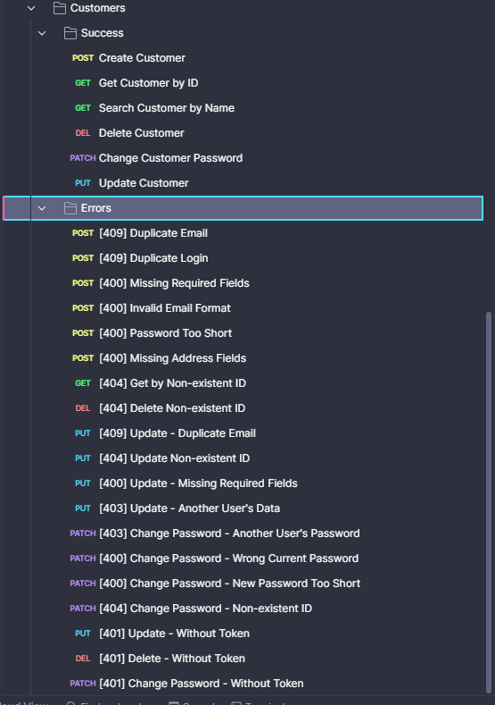

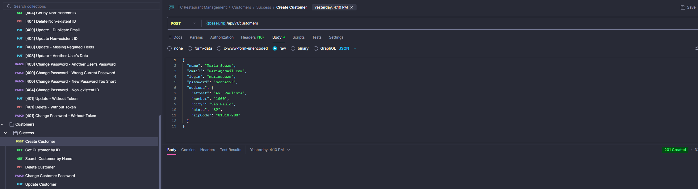

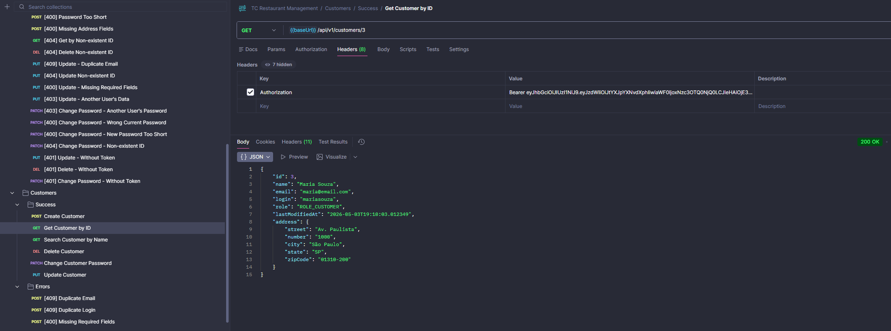

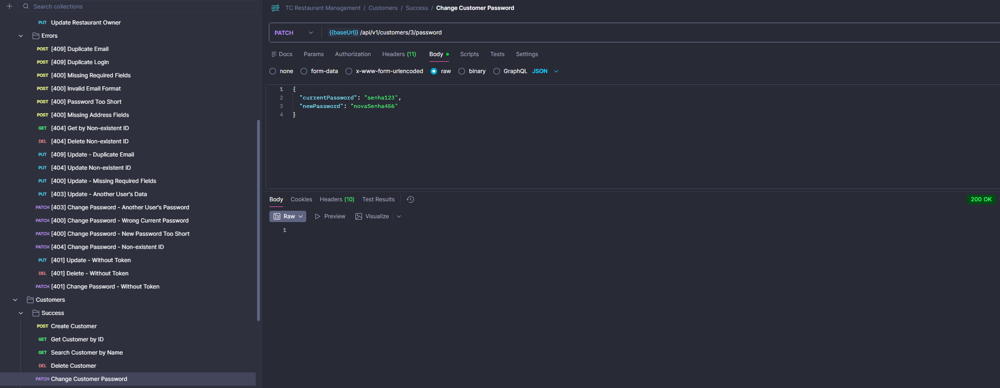

#### Restaurant Owners

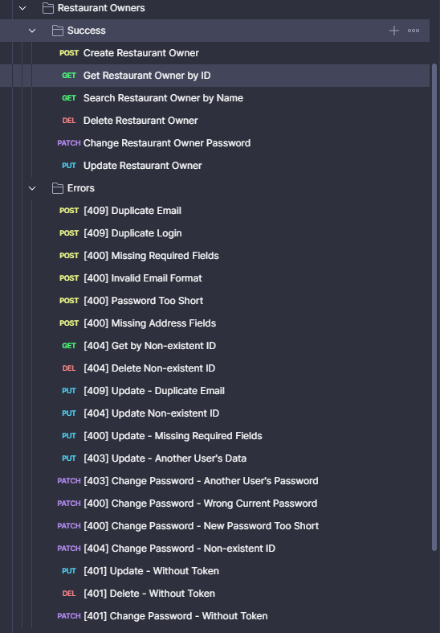

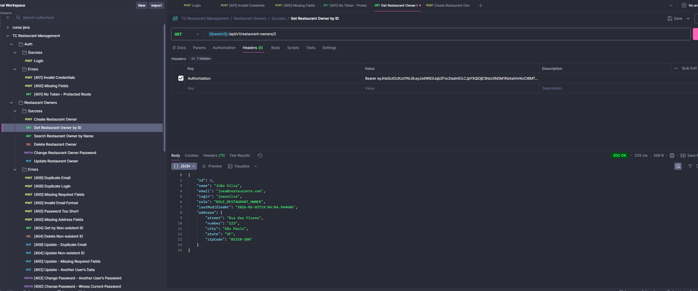

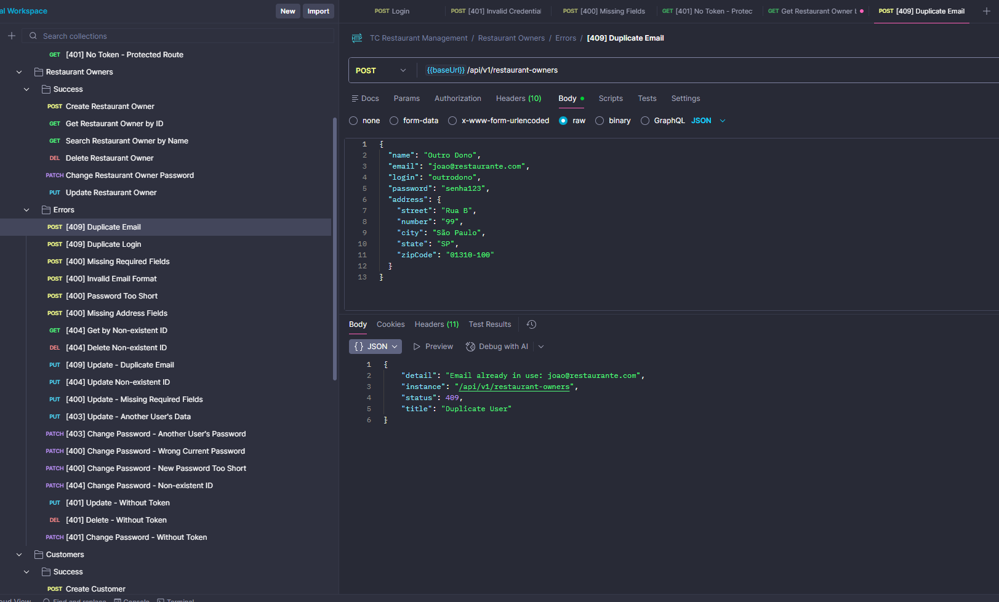

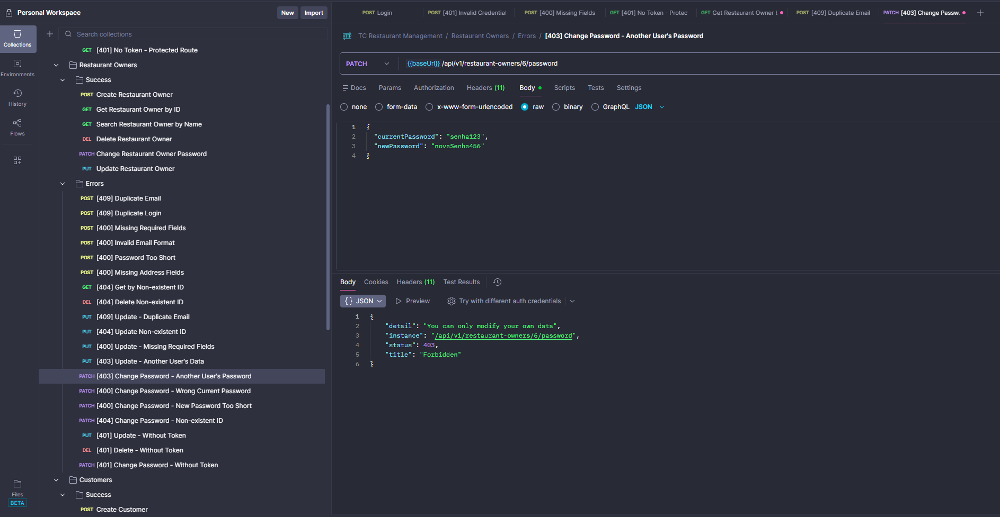
